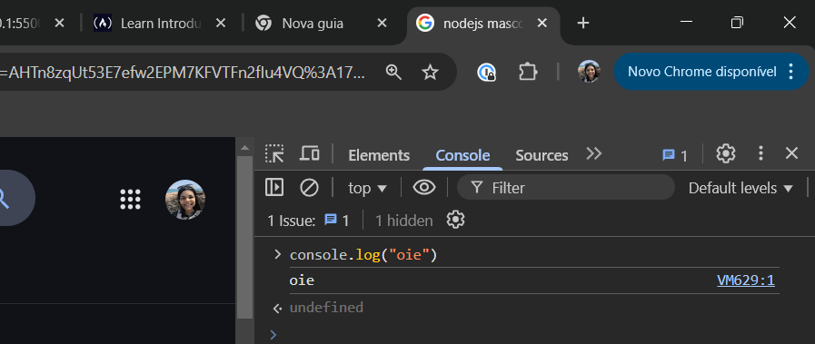
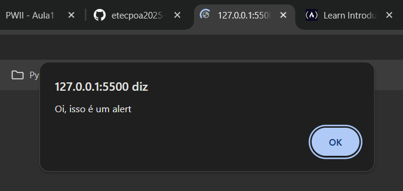

# :computer: :turtle: olá mundo! 

> Este é um arquivo de instruções, você encontrará em cada pasta de estudo deste repositório. A professora irá deixar aqui as informações relacionadas com a aula. :heart_eyes:

### WELCOME ABOARD!

Este será o seu primeiro programa na jornada javascript aqui na *ETEC Poá*.

**Para te ajudar, aqui vão algumas *infos*:**

**Arquivos javascript**

O arquivo com a extensão `.js`, é o arquivo que receberá código javascript. Use ele para escrever código :sunglasses:.

### Aula de hoje :blue_book:

Hoje vamos aprender alguns comandos. Segue o significado de cada um:

1. **console.log** 
   `console.log()`: Usado para imprimir valores/informações do código para o terminal do seu computador ou console do seu browser.

  

2. **alert()**
   `alert()`: Usado para enviar um alerta diretamente no browser do usuário. **Importante**, somente use o `alert` na vida real, se for algo muito critico que você queira interromper a navegação do usuário #ficaadica.

    

3. **prompt()**
   `prompt()`: Usado para permitir que o usuário responda a um alerta.**Importante**, assim como o uso do `alert`, utilize na vida real, somente se for algo muito critico que você queira interromper a navegação do usuário #ficaadica. Utilize formulários html para receber dados do usuário.

4. **declaração de variáveis e constantes** 
   Variáveis são usadas para guardar valores. Uma variável é capaz de armazenar muitos tipos de valores, como números, valores booleanos, strings, listas (arrays), etc.

   `let e var`: criam uma variável. Preferencialmente utilize o let, mais detalhes [aqui](https://developer.mozilla.org/pt-BR/docs/Web/JavaScript/Reference/Statements/let#descri%C3%A7%C3%A3o).
   `const`: cria uma constante.

Agora siga as instruções do sua professora :heart:
Boa aula!