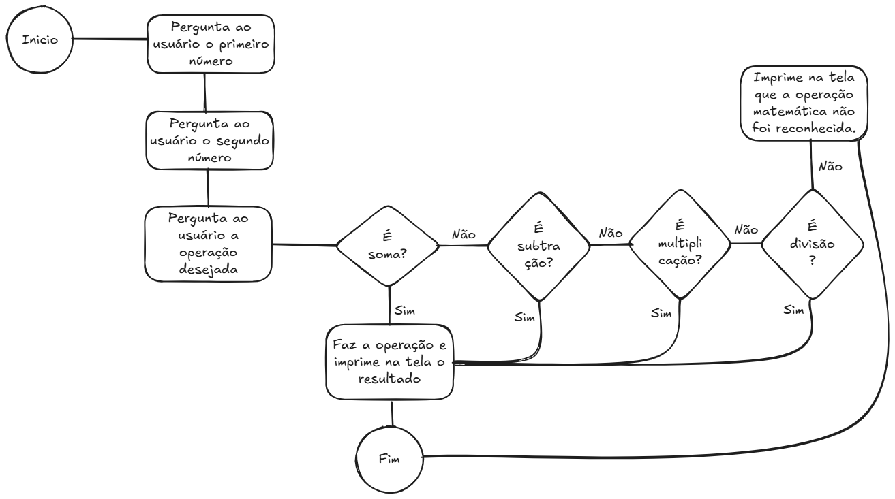

# :computer: :turtle: Controle de fluxo



### Padrões

1. **Valores booleanos** 
   
   `true`: Quer dizer que algo ou alguma comparação é verdadeira. Ex.: (2+2) == 4

   `false`: Quer dizer que algo ou alguma comparação é falsa. Ex.: (-2+2) == 4

2. **Operadores de comparação**
   
    Os operadores de comparação comparam dois valores e são avaliados como um único valor booleano.
   
   | Operador  | Significado       |
   |:---------:|:-----------------|
   |  ==       | Igual a           |
   |  ===      | Exatamente Igual a|
   |  !=       | Diferente de      |
   |  >        | Maior que         |
   |  <        | Menor que         |
   |  <=       | Menor ou igual a  |
   |  >=       | Maior ou igual a  |

3. **Operadores de lógica**
   
   | Operador  | Significado       |
   |:---------:|:-----------------|
   |  \|\|        | Significa **ou**. Resultado é verdadeiro se qualquer uma das expressões é verdadeiro.|
   |  &&       | Significa **e**. Resultado é verdadeiro se ambas as expressões são verdadeiras.|
   |  !        | Significa **não**. Resultado é verdadeiro se a expressões é falsa.|

4. **Controlando fluxo (`If`, `else if` e `else`)**
    
    `if (condição){...}`: Usado para executar um bloco de código se a condição passada for `verdadeira`.

   Exemplo:
   ```javascript
   if (name == "Alice"){
      console.log("Hi, Alice");
   }  
   ```  

   ```javascript
   if (name == "Alice" && sobrenome="Wonderland"){
      console.log("Hi, Alice in wonderland");
   }  
   ```  

   `else:` : caso haja a necessidade de executar alguma instrução, caso a condição `if` for falsa, podemos usar a estrutura do else.
   
   Exemplo:
   ```javascript
   if (name == "Alice"){
      console.log("Hi, Alice");
   } else{
      console.log("Hello stranger, você não é Alice");
   }
   ``` 

   `else if:` : Diferentemente do else, ela provê outra condição que será verificada somente se todas as condições anteriores forem False.
   
   Exemplo:
   ```javascript
   if (name == "Alice"){
      console.log("Hi, Alice");
   } else if(name == "Alicia"){
      console.log("Hi, Alicia");
   } else{
      console.log("Hello stranger, você não é Alice e nem Alicia");
   }
   ```  

Agora siga as instruções do sua professora :heart:
Boa aula!